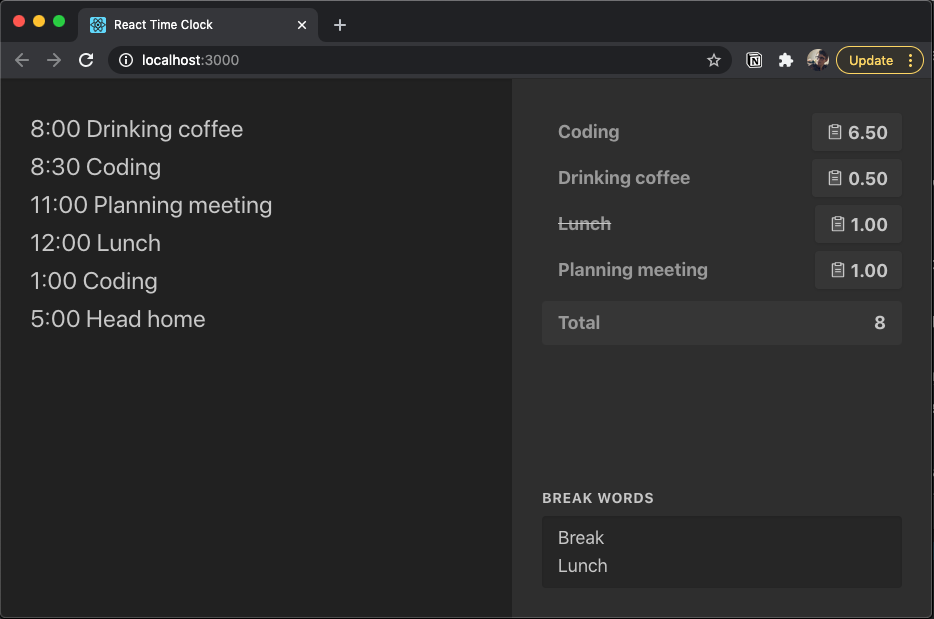

# Online demo:
[react-time-clock.netlify.app](https://react-time-clock.netlify.app/)

# Overview
My first React and Typescript project. Also trying to get better at Unit testing.

I tend to keep track of my day as plain text in my notes app.

This app parses each line of text and calculates the durations between them.

For example...

```
8:00 - Planning Meeting
9:30 - Coffee break
```

... is logged as `1.5 hr - Planning meeting`

Your day get summarized in the right column. You can even exclude specific words such as `Lunch` or `Break` so you can see how many hours total of "work" you have logged.

